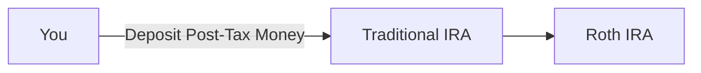

---
{"dg-publish":true,"permalink":"/ira/","dg-note-properties":{}}
---

Backdoor Contribution Steps
1. **Contribute:** Open a **Traditional IRA** and fund it with a non-deductible (after-tax) contribution up to the annual limit. Leave it in cash.
2. **Convert:** Once the funds settle (usually 1–2 days), use your brokerage's online tool to **convert** the entire balance into a **Roth IRA**.

> Note: Ensure your pre-tax IRA balances are $0 to avoid the IRS pro-rata rule, and file **Form 8606** with your taxes... as in, don't have any other IRA's open, like something from an old company. 401k's are fine, only issue would be *IRA's*.

Benefits:
- 