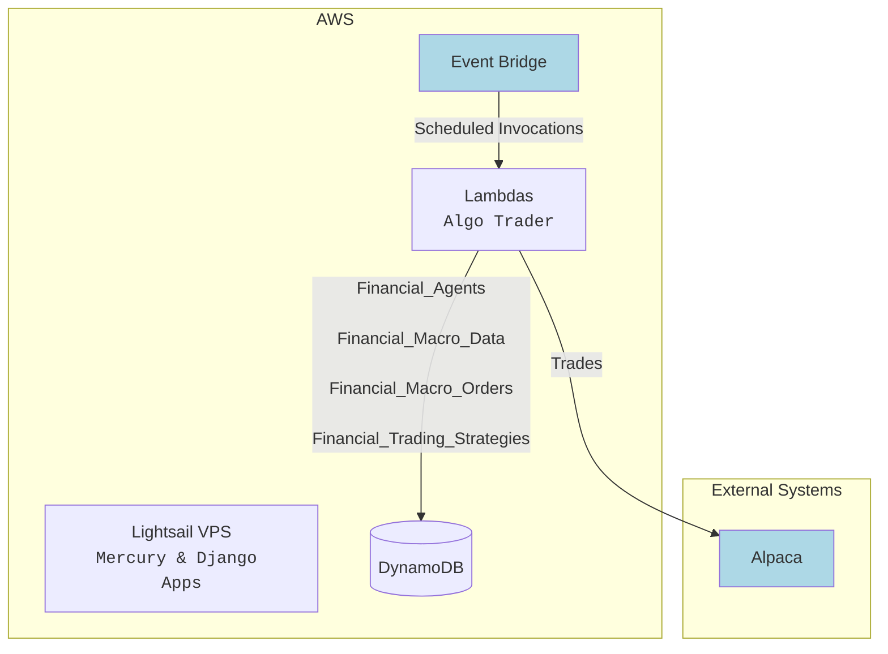

---
{"dg-publish":true,"permalink":"/projects/projects-home/","dg-note-properties":{}}
---

### Key Projects

| Project Name                  | Descripton                                                                                                       | Notes                                                    | Site                                                                         |
| ----------------------------- | ---------------------------------------------------------------------------------------------------------------- | -------------------------------------------------------- | ---------------------------------------------------------------------------- |
| Algo Trader                   | Houses agents for securities Trading - Value Agent: trades bond ETFs - Options Agent (WIP): trades options | [SS 7/1] Next milestone I think is backtesting module... | https://python-trade-and-predict.vercel.app/                                 |
| Python Server Apps            | Contains some `Net Worth Modeling Tools` and a Django App (uses my Lightsail VPS)                                | ...                                                      | [python-server-apps](https://github.com/shawn-don-soneja/python-server-apps) |
| Shawn Home - Monorepo of Apps | Contains a CLI, right now. Intended to support `Python` and `TypeScript` projects                                |                                                          | [shawn-home](https://github.com/shawn-don-soneja/shawn-home)                 |

