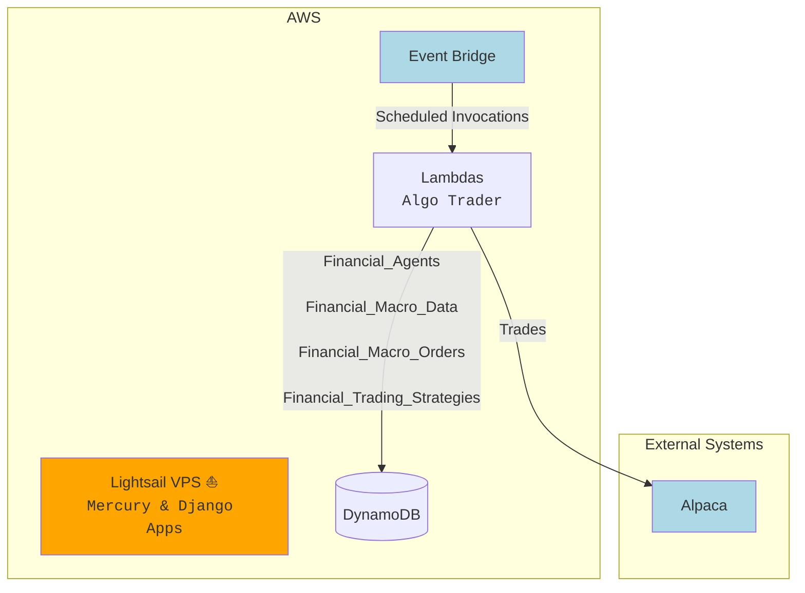
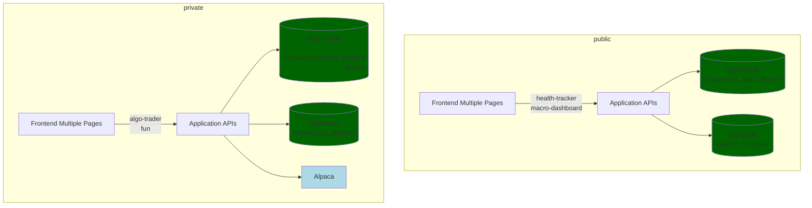

---
{"dg-publish":true,"permalink":"/projects/projects-home/","dg-note-properties":{}}
---

### Key Projects

| #   | Project Name                  | Descripton                                                                                                                      | Notes                                                                                                 | Site                                                                                                                                                   |     |
| --- | ----------------------------- | ------------------------------------------------------------------------------------------------------------------------------- | ----------------------------------------------------------------------------------------------------- | ------------------------------------------------------------------------------------------------------------------------------------------------------ | --- |
| 1   | Algo Trader                   | Houses **agents** for securities Trading: - Value Agent which trades bond ETFs - Options Agent (WIP) which trades options | [SS 7/1] Next milestone I think is backtesting module...                                              | https://python-trade-and-predict.vercel.app/                                                                                                           |     |
| 2   | Python Server Apps            | Contains some `Net Worth Modeling Tools` and a Django App (uses my Lightsail VPS)                                               | ...                                                                                                   | [python-server-apps](https://github.com/shawn-don-soneja/python-server-apps)                                                                           |     |
| 3   | Shawn Home - Monorepo of Apps | Contains a CLI, right now. Intended to support `Python` and `TypeScript` projects                                               |                                                                                                       | [shawn-home](https://github.com/shawn-don-soneja/shawn-home)                                                                                           |     |
| 4   | Knowledge Base                | **Obsidian** Knowledge base                                                                                                     |                                                                                                       | https://my-knowledge-base-taupe.vercel.app/  [knowledge-base](https://github.com/shawn-don-soneja/knowledge-base)                                |     |
| 5   | NextJS Apps                   | 1. public 2. private                                                                                                         | - macro-dashboard - health-tracker  --------  - algo-trader - fun (notes and links) | [next-js-practice](https://github.com/shawn-don-soneja/next-js-practice)  [next-js-private](https://github.com/shawn-don-soneja/next-js-private) |     |

`#1 Algo Trader & #2 Python Server Apps`

`#5 NextJS Apps - private and public`
